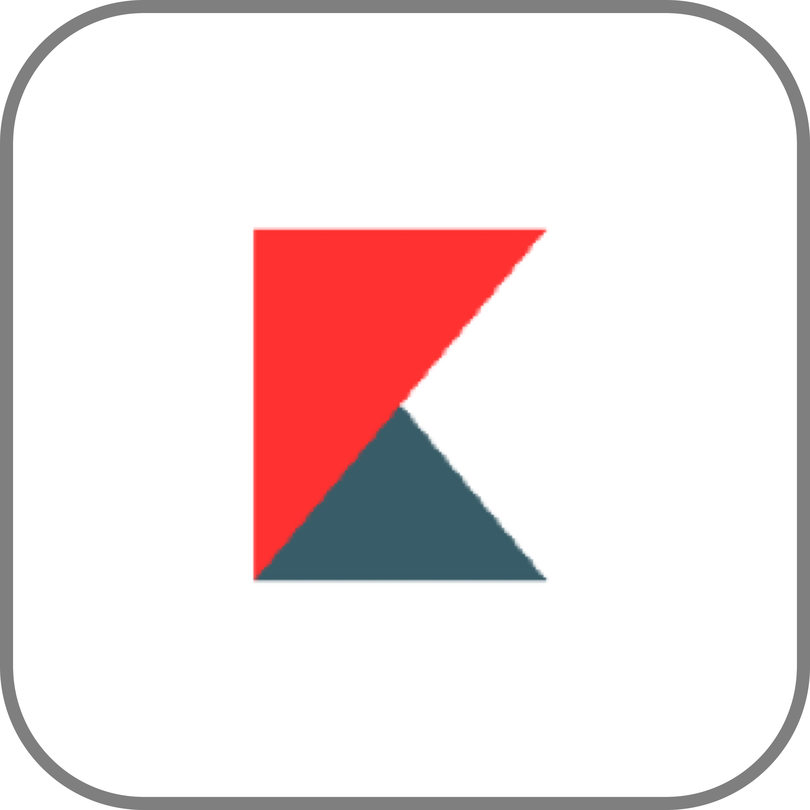

  
  <h1>kebab-gui | v1.1.3</h1>
  <b>A high-performance, window-based operating system environment built entirely in Pygame. Features a custom kernel with event routing, window management, and graphical web rendering.</b>

---
 

## Screenshot

## Default Features

- Dynamic Window Manager: Drag, resize, and stack multiple applications.
- Smart Taskbar: Pin/unpin apps via context menus with real-time "running" indicators (teal bar).
- Default Apps: Browser, Calculator, Files, Notebook, Terminal, Tester.
- Clipboard Support: Full clipboard functionality in text fields.
- Persistence: Saves your state and settings to `storage/data.json`.

## Documentation

Find the GUI docs for kebabOS in [the docs directory](../docs), or read the full documentation at [docs.kebabos.me](https://docs.kebabos.me).

> [!IMPORTANT]
> The browser app requires a Chromium-based browser (Google Chrome, Microsoft Edge, or Chromium) installed on your system to render webpage graphics

## Controls & Usage

**Action	Control:**
- Open Start Menu	Click the kebab icon (bottom-left)
- Pin to Taskbar	Right-click app in Start Menu -> "Pin to Taskbar"
- Unpin App	Right-click icon on Taskbar -> "Unpin"
- Resize Window	Drag the bottom-right corner handle
- Paste URL	Press Ctrl + V while the Browser is active
- Clear URL Bar	Click the × button in the Browser address bar
- Scroll Webpage	Use the Mouse Wheel inside the Browser window

## Default Applications

These are the appliactions that come pre-installed (in the applications directory) with the live image:
- Notebook
- Files
- Calculator
- Browser

To find out how to make your own kebab-os applications, read the [developer docs](../docs/Custom_Apps.md).

## Developer Notes

Event Routing: The kernel automatically sends `KEYDOWN` and `MOUSEWHEEL` events to the top-most (active) window.
Clipping: Content is rendered using `surface.set_clip()` to prevent UI overlap during resizing or scrolling.
[Learn how to create applications.](../docs/Custom_Apps.md)

## License

kebab-gui is licensed under the [MIT License](../LICENSE).

  

&copy; kebab-gui 2026

