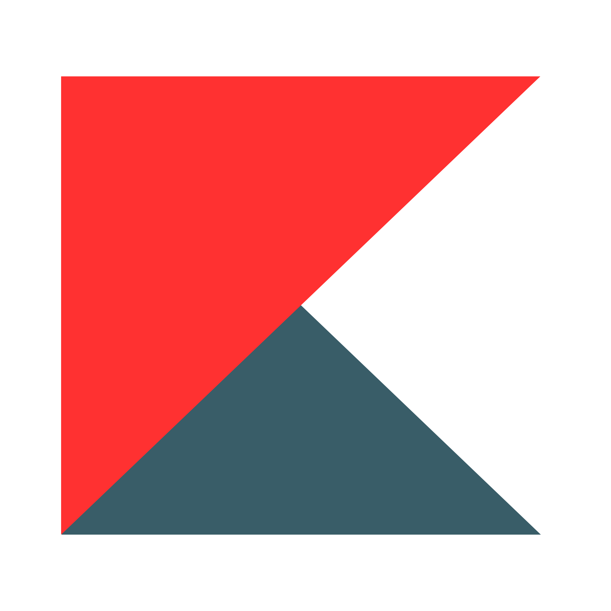

  
  <h1>kebab-gui - v1.0.0</h1>
  <b>A high-performance, window-based operating system environment with a custom kebab_graphics runtime (pygame-compatible). Features a custom kernel with event routing, window management, and graphical web rendering.</b>

---

## Features

- Dynamic Window Manager: Drag, resize, and stack multiple applications.
- Smart Taskbar: Pin/unpin apps via context menus with real-time "running" indicators (teal bar).
- kebabBrowser: Graphical web rendering using `html2image` with scroll support and clipboard integration.
- Clipboard Support: Full Ctrl+V pasting functionality in text fields.
- Persistence: Saves per-user state under `storage/users/<username>/` and global settings in `.config/settings.ini`.

## Documentation

Find the GUI docs for kebabOS in [the docs directory](docs), or read the full documentation at [docs.kebabos.me](https://docs.kebabos.me).

For VM kiosk boot instructions, see [VM Mode](docs/VM.md).
For runtime architecture, see [kebab_graphics](docs/Kebab_Graphics.md).
For a VirtualBox-bootable ISO workflow, see [Bootable Image](docs/Bootable_Image.md).

> [!IMPORTANT]
> The browser app requires a Chromium-based browser (Google Chrome, Microsoft Edge, or Chromium) installed on your system to render webpage graphics

## Controls & Usage

**Action	Control:**
- Open Start Menu	Click the kebab icon (bottom-left)
- Pin to Taskbar	Right-click app in Start Menu -> "Pin to Taskbar"
- Unpin App	Right-click icon on Taskbar -> "Unpin"
- Resize Window	Drag the bottom-right corner handle
- Paste URL	Press Ctrl + V while the Browser is active
- Clear URL Bar	Click the × button in the Browser address bar
- Scroll Webpage	Use the Mouse Wheel inside the Browser window

## Developer Notes

Event Routing: The kernel automatically sends `KEYDOWN` and `MOUSEWHEEL` events to the top-most (active) window.
Clipping: Content is rendered using `surface.set_clip()` to prevent UI overlap during resizing or scrolling.
[Learn how to create applications.](docs/Custom_Apps.md)

Graphics Runtime: App and kernel modules import `kebab_graphics` instead of importing `pygame` directly.

## License

kebabOS is under the [MIT License](LICENSE).

  

  &copy; kebab 2026

